---

# C Lexer – Tokenizer for C/C++ Source Code
<p align="center">
  
</p>

This project implements a **Lexical Analyzer (Lexer)** written in the **C programming language**.
The lexer reads C-like source code and breaks it into meaningful components called **tokens** such as keywords, identifiers, operators, literals, and delimiters.

A lexical analyzer is the **first stage of a compiler pipeline**, responsible for converting raw program text into a structured stream of tokens that can later be processed by a parser.

This project demonstrates how programming languages internally analyze source code and identify its syntactic elements.

---

# Project Repository

GitHub Repository

[https://github.com/Abineshabee/Lexer-in-c](https://github.com/Abineshabee/Lexer-in-c)

---

# Project Motivation

Compilers do not directly understand source code. Instead, they process programs through several stages.

The **lexer** is responsible for scanning characters and grouping them into tokens.

Example source code:

```c
int x = 10;
```

The lexer converts it into tokens:

```
INT
IDENTIFIER(x)
ASSIGN
NUMBER(10)
SEMICOLON
```

This project demonstrates how such a system can be implemented from scratch using C.

---

# Compiler Pipeline

The lexer is the first step in the compilation process.

```
Source Code
     ↓
Lexical Analysis (Lexer)
     ↓
Token Stream
     ↓
Syntax Analysis (Parser)
     ↓
Abstract Syntax Tree
     ↓
Semantic Analysis
     ↓
Code Generation
```

This project implements the **Lexical Analysis stage**.

---

# Features

The lexer supports a large number of tokens including:

• Identifiers
• Numeric literals
• String literals
• Character literals
• Arithmetic operators
• Logical operators
• Bitwise operators
• Assignment operators
• Control flow keywords
• C/C++ keywords
• Python-like built-in functions
• String manipulation functions
• Mathematical functions

---

# Project Structure

| File                   | Description                           |
| ---------------------- | ------------------------------------- |
| lexer.c                | Main lexer implementation             |
| Token enum             | Defines token types                   |
| Token struct           | Stores token information              |
| get_next_token()       | Core token extraction logic           |
| token_type_to_string() | Converts token enums to readable text |

---

# Core Components

## Token Enumeration

The program defines an enumeration for token types.

```c
enum TokenType {
    TOKEN_IDENTIFIER,
    TOKEN_NUMBER,
    TOKEN_PLUS,
    TOKEN_MINUS,
    TOKEN_MULTIPLY,
    TOKEN_DIVIDE
};
```

This helps categorize different components of the source code.

---

# Token Structure

Each token has two properties:

```
struct Token {
    enum TokenType type
    char value[MAX_TOKEN_LEN]
}
```

Example token:

```
Type : IDENTIFIER
Value: x
```

---

# Lexer Algorithm

The lexer works using a **character scanning algorithm**.

Steps:

1. Skip whitespace
2. Detect identifiers or keywords
3. Detect numbers
4. Detect operators
5. Detect string literals
6. Detect character literals
7. Return token

---

# Supported Token Categories

## 1. Identifiers

Identifiers represent variable or function names.

Example:

```c
int count;
```

Tokens:

```
INT
IDENTIFIER(count)
SEMICOLON
```

---

# 2. Numeric Literals

Numbers can be integers or floating point values.

Example:

```
5
3.14
```

Token output:

```
NUMBER(5)
NUMBER(3.14)
```

---

# 3. String Literals

Strings are enclosed in double quotes.

Example:

```c
"Hello World"
```

Token:

```
STRING_LITERAL("Hello World")
```

---

# 4. Character Literals

Example:

```c
'a'
```

Token:

```
CHAR_LITERAL('a')
```

---

# 5. Arithmetic Operators

| Operator | Token    |
| -------- | -------- |
| +        | PLUS     |
| -        | MINUS    |
| *        | MULTIPLY |
| /        | DIVIDE   |
| %        | MODULO   |

Example:

```c
x + y
```

Tokens:

```
IDENTIFIER(x)
PLUS
IDENTIFIER(y)
```

---

# 6. Assignment Operators

| Operator | Token          |
| -------- | -------------- |
| =        | ASSIGN         |
| +=       | PLUS_EQUAL     |
| -=       | MINUS_EQUAL    |
| *=       | MULTIPLY_EQUAL |
| /=       | DIVIDE_EQUAL   |
| %=       | MODULO_EQUAL   |

Example:

```
x += 5
```

Tokens:

```
IDENTIFIER(x)
PLUS_EQUAL
NUMBER(5)
```

---

# 7. Comparison Operators

| Operator | Token         |
| -------- | ------------- |
| ==       | EQUAL         |
| !=       | NOT_EQUAL     |
| <        | LESS_THAN     |
| >        | GREATER_THAN  |
| <=       | LESS_EQUAL    |
| >=       | GREATER_EQUAL |

Example:

```c
x > 10
```

Tokens:

```
IDENTIFIER(x)
GREATER_THAN
NUMBER(10)
```

---

# 8. Logical Operators

| Operator | Token |  
| -------- | ----- | 
| &&       | AND   |   
| \|\|     | OR    |  
| !        | NOT   |  

Example:

```c
x > 0 && y < 10
```

---

# 9. Bitwise Operators

| Operator | Token       |       
| -------- | ----------- | 
| &        | BIT_AND     |       
| \|       | BIT_OR      |
| ^        | BIT_XOR     |        
| ~        | BIT_NOT     |        
| <<       | LEFT_SHIFT  |        
| >>       | RIGHT_SHIFT |        

---

# 10. Delimiters

| Symbol | Token         |
| ------ | ------------- |
| (      | LEFT_PAREN    |
| )      | RIGHT_PAREN   |
| {      | LEFT_BRACE    |
| }      | RIGHT_BRACE   |
| [      | LEFT_BRACKET  |
| ]      | RIGHT_BRACKET |
| ;      | SEMICOLON     |
| ,      | COMMA         |

---

# 11. Control Flow Keywords

| Keyword  |
| -------- |
| if       |
| else     |
| while    |
| for      |
| do       |
| switch   |
| case     |
| break    |
| continue |
| return   |

Example:

```c
if (x > 0)
```

Tokens:

```
IF
LEFT_PAREN
IDENTIFIER(x)
GREATER_THAN
NUMBER(0)
RIGHT_PAREN
```

---

# 12. Data Types

Supported data types:

| Type   |
| ------ |
| int    |
| float  |
| double |
| char   |
| short  |
| long   |
| void   |
| bool   |

Example:

```
float y = 3.14
```

Tokens:

```
FLOAT
IDENTIFIER(y)
ASSIGN
NUMBER(3.14)
```

---

# 13. String Functions

The lexer also detects built-in string operations.

| Function   |
| ---------- |
| upper      |
| lower      |
| capitalize |
| count      |
| find       |
| replace    |
| reverse    |
| title      |

Example:

```
upper(str)
```

Tokens:

```
UPPER
LEFT_PAREN
IDENTIFIER(str)
RIGHT_PAREN
```

---

# 14. Mathematical Functions

Supported math functions:

| Function |
| -------- |
| abs      |
| ceil     |
| floor    |
| round    |

Example:

```
abs(x)
```

Token:

```
ABS
```

---

# Example Program

Input code:

```c
int main() {
    int x = 5;
    float y = 3.14;
    char* str = "Hello, World!";
    
    if (x > 0 && y < 10.0) {
        printf("%d %f\n", x, y);
    }
    
    return 0;
}
```

---

# Example Lexer Output

```
Token: Type=INT                  Value=int
Token: Type=IDENTIFIER           Value=main
Token: Type=LEFT_PAREN           Value=(
Token: Type=RIGHT_PAREN          Value=)
Token: Type=LEFT_BRACE           Value={
Token: Type=INT                  Value=int
Token: Type=IDENTIFIER           Value=x
Token: Type=ASSIGN               Value==
Token: Type=NUMBER               Value=5
Token: Type=SEMICOLON            Value=;
```

---

# How to Compile

Compile the lexer using **GCC**.

```bash
gcc lexer.c -o lexer
```

---

# Run the Program

```
./lexer
```

The program will analyze the input string and print tokens.

---

# Educational Importance

This project demonstrates key compiler concepts:

• Lexical Analysis
• Tokenization
• Programming language syntax
• Compiler front-end design

It is useful for students learning:

• Compilers
• Programming language design
• Static analysis tools

---

# Future Improvements

Possible improvements include:

• Comment detection
• Full C grammar parser
• File input support
• Error handling
• AST generation
• Syntax highlighting engine

---

# Author

Abinesh N

GitHub
[https://github.com/Abineshabee](https://github.com/Abineshabee)

---

## License

This project is licensed under the [GNU General Public License v3.0](LICENSE) - see the [LICENSE](LICENSE) file for details.
---

